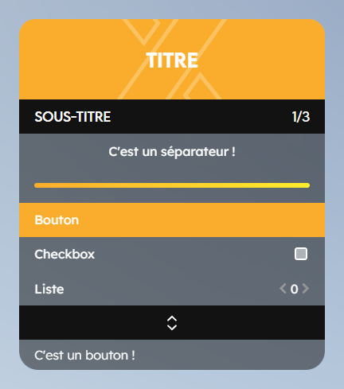

# Présentation

**zUI** est une bibliothèque avancée dédiée à la création de menus NUI pour **FiveM**, qui allie sobriété, optimisation et esthétique. Ce projet vise à moderniser la création de menus tout en facilitant le travail des développeurs grâce à une interface intuitive et performante.

## Technologies Utilisées

- **React** pour l'interface utilisateur, offrant une structure moderne et dynamique.
- **Lua** pour les scripts, permettant une gestion fluide de l'intégration dans FiveM.

Cette combinaison de technologies permet à zUI d'apporter une expérience utilisateur optimisée tout en offrant une flexibilité maximale pour les développeurs.

## Points Forts de zUI

- **Optimisation** : zUI est conçu pour fonctionner de manière fluide, même sur des serveurs avec des performances limitées. Chaque élément est optimisé pour réduire au minimum l'impact sur le serveur.
- **Sobriété et Esthétique** : Inspiré de **RageUI**, zUI apporte une esthétique épurée et moderne à vos interfaces de menus, sans sacrifier la simplicité d'utilisation.
- **Facilité de Création** : zUI simplifie le processus de création de menus interactifs, permettant aux développeurs de se concentrer sur l'essentiel.

## Inspirations et Améliorations

Bien que **zUI** s'inspire largement de **RageUI**, il se distingue par plusieurs améliorations notables :

- Une **meilleure gestion des performances** pour des menus plus réactifs et plus fluides.
- Une **interface utilisateur modernisée**, exploitant les possibilités de **React** pour offrir une expérience plus riche et interactive.

## Pourquoi Choisir zUI ?

Si vous cherchez une solution fiable et élégante pour créer des menus NUI sur FiveM, zUI est fait pour vous. Que vous soyez un développeur expérimenté ou débutant, cette bibliothèque vous fournira les outils nécessaires pour concevoir des menus à la fois esthétiques et performants.

## Contribution et Support

Nous encourageons la communauté à contribuer à l'amélioration de zUI. Si vous rencontrez des problèmes ou avez des suggestions d'améliorations, n'hésitez pas à ouvrir un ticket sur notre [serveur Discord Support](https://discord.gg/lien). Vous pouvez également consulter la documentation pour en savoir plus sur l'utilisation de zUI.

---

zUI, développé par **zSquad**, est un outil en constante évolution, pensé pour répondre aux besoins des développeurs de la communauté FiveM.

---

